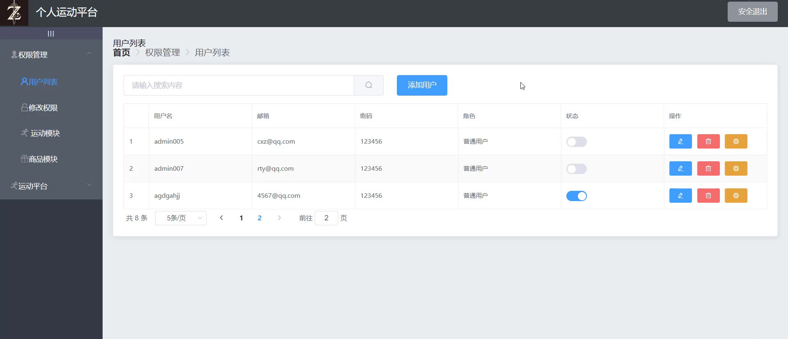

# Project

## 1、项目介绍

- 一个简单的**前后端交互**的练习项目，实现在Web对User进行操作

- [前端源代码](https://github.com/AsheOne18/Vue-Backstage)    [后端源代码](https://github.com/AsheOne18/SpringBoot-Backstage) （本来是想写成个人运动平台，结果写一半发现全是Bug）


## 2、使用技术
**前台管理**
- Vue+elementUI
  
**后台开发**
- SpringBoot+Mybatis
<br>

**项目架构(一个Demo，哪来的架构？？？)**

- 采取前后端分离开发，前端为vue后端为java。使用springBoot做跨域请求


## 3、实现功能

- 1、Web层面
- 登录、后台系统（权限管理等，增删改查功能实现）
- 2、后台层面
- 提前编写各个模块的路由方便分发，创建关系型数据库。


## 4、如何Run起来？
**后台**
<br>
1、打开你的
```
IntelliJ IDEA
```
2、记得先创建数据库，Sql文件在[后端源代码](https://github.com/AsheOne18/SpringBoot-Backstage)里面的Main目录下

3、修改数据库配置信息
```
Application.yml
```
4、直接Run！

**前端**
<br>
1、项目设置
```
npm install
```

2、设置命令
```
npm run serve
```
3、开Run
```
npm run build
```
5、Sql代码（备注）
```sql
SET FOREIGN_KEY_CHECKS=0;

-- ----------------------------
-- Table structure for easyuser
-- ----------------------------
DROP TABLE IF EXISTS `easyuser`;
CREATE TABLE `easyuser` (
  `id` int(24) NOT NULL AUTO_INCREMENT COMMENT '主键',
  `username` varchar(255) NOT NULL,
  `password` varchar(255) NOT NULL,
  `email` varchar(255) NOT NULL,
  `role` varchar(255) NOT NULL,
  `state` tinyint(255) NOT NULL DEFAULT '0',
  PRIMARY KEY (`id`)
) ENGINE=InnoDB AUTO_INCREMENT=10 DEFAULT CHARSET=utf8;

-- ----------------------------
-- Records of easyuser
-- ----------------------------
INSERT INTO `easyuser` VALUES ('1', 'admin', '123456', '123@qq.com', '超级管理员', '1');
INSERT INTO `easyuser` VALUES ('2', 'naughty', '888888', '456@qq.com', '普通管理员', '0');
INSERT INTO `easyuser` VALUES ('3', 'flysky01', '987654', 'qwe@qq.com', '普通用户', '1');
INSERT INTO `easyuser` VALUES ('4', 'anglybirds', '321654', 'aaaa@163.com', '普通用户', '0');
INSERT INTO `easyuser` VALUES ('7', 'admin003', 'q123456', 'c@qq.com', '普通用户', '1');
INSERT INTO `easyuser` VALUES ('8', 'admin005', '123456', 'cxz@qq.com', '普通用户', '0');
INSERT INTO `easyuser` VALUES ('9', 'admin007', '123456', 'rty@qq.com', '普通用户', '0');
```
```sql
SET FOREIGN_KEY_CHECKS=0;

-- ----------------------------
-- Table structure for mainmenu
-- ----------------------------
DROP TABLE IF EXISTS `mainmenu`;
CREATE TABLE `mainmenu` (
  `id` int(50) NOT NULL AUTO_INCREMENT,
  `title` varchar(255) NOT NULL,
  `path` varchar(255) NOT NULL,
  PRIMARY KEY (`id`)
) ENGINE=InnoDB AUTO_INCREMENT=201 DEFAULT CHARSET=utf8;

-- ----------------------------
-- Records of mainmenu
-- ----------------------------
INSERT INTO `mainmenu` VALUES ('100', '权限管理', '/admin');
INSERT INTO `mainmenu` VALUES ('200', '运动平台', '/use');
```
```sql
SET FOREIGN_KEY_CHECKS=0;

-- ----------------------------
-- Table structure for submenu
-- ----------------------------
DROP TABLE IF EXISTS `submenu`;
CREATE TABLE `submenu` (
  `id` int(50) NOT NULL AUTO_INCREMENT,
  `title` varchar(255) NOT NULL,
  `path` varchar(255) NOT NULL,
  `mid` int(50) NOT NULL,
  PRIMARY KEY (`id`),
  KEY `mid` (`mid`),
  CONSTRAINT `submenu_ibfk_1` FOREIGN KEY (`mid`) REFERENCES `mainmenu` (`id`)
) ENGINE=InnoDB AUTO_INCREMENT=204 DEFAULT CHARSET=utf8;

-- ----------------------------
-- Records of submenu
-- ----------------------------
INSERT INTO `submenu` VALUES ('101', '用户列表', '/user', '100');
INSERT INTO `submenu` VALUES ('102', '修改权限', '/rights', '100');
INSERT INTO `submenu` VALUES ('103', ' 运动模块', '/sport', '100');
INSERT INTO `submenu` VALUES ('104', '商品模块', '/goods', '100');
INSERT INTO `submenu` VALUES ('201', '运动科普', '/Introduction', '200');
INSERT INTO `submenu` VALUES ('202', '卡路里', '/calories', '200');
INSERT INTO `submenu` VALUES ('203', '营养配餐', '/food', '200');
```
